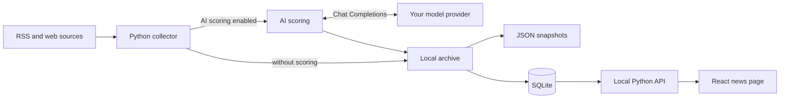

# SpiderAI

**Collect AI news, score it with your own model, and browse it locally.**

SpiderAI pulls articles from RSS feeds, WeChat public account RSS feeds, and static web pages. It stores articles in SQLite and serves a searchable React interface. AI scoring is optional and works with an OpenAI Chat Completions compatible API of your choice.

## How it works



The model provider receives article material only when scoring is enabled. The local page reads from SQLite; opening it does not start a collection or model request.

## Quick start

**Requirements:** Python 3.10+. To use the web page, you also need Node.js and npm. Run these commands from the repository root.

```bash
python3 -m venv .venv
source .venv/bin/activate
python -m pip install -r requirements.txt
cp -n .env.example .env
```

Edit `.env` with the endpoint, model ID, and API key supplied by your provider:

```dotenv
AI_API_URL=https://your-provider.example/v1/chat/completions
AI_MODEL=your-model-id
AI_API_KEY=your-api-key
```

`AI_API_URL` must be the **full Chat Completions endpoint**, rather than the provider homepage or base `/v1` URL. Do not add `Bearer` to the key. Environment variables take precedence over `.env`, and `.env` is ignored by Git. No provider, model, or key is built into the application.

Collect, score, and archive the enabled sources:

```bash
python collecter.py
```

To collect without an API key, use `python collecter.py --no-score`. The initial [source configuration](config/sources.json) enables a small set of feeds; edit `enabled` and `max_articles` to change it.

Build and open the local web page:

```bash
cd web
npm ci
npm run build
cd ..
python -m app.web
```

Visit <http://127.0.0.1:8765> and refresh the page after collecting. The interface includes 24-hour and 7-day views, search, source filters, favorites, reading history, and dark mode.

## Bring your own model

| Setting | Purpose |
| --- | --- |
| `AI_API_URL` | Full Chat Completions endpoint; HTTPS or local HTTP |
| `AI_MODEL` | Model ID sent to the provider |
| `AI_API_KEY` | Your key, sent as a Bearer token |
| `AI_TOKEN_PARAM` (optional) | Output length field: `max_tokens` by default, or `max_completion_tokens` if required by your provider |

The client sends ordinary `system` and `user` messages and expects a non-streaming JSON response with text in `choices[0].message.content`. APIs with other protocols need a separate adapter. See [app/llm.py](app/llm.py) for the implementation.

Test your configuration with one request before scoring a feed:

```bash
python -m app.llm --prompt "Introduce yourself in one sentence."
python -m app.llm --article examples/article.txt
```

If you are upgrading from an earlier version, rename `WEMUST_API_KEY` in your local `.env` to `AI_API_KEY`, then add `AI_API_URL` and `AI_MODEL`. The old `python -m app.qwen` command and `QwenClient` import remain available, but use the same new configuration.

A 401 response usually points to the key; 403 to model access; 400/404 to the model ID, endpoint, or request parameters; and 429 to rate limits or quota. Network errors are not retried automatically. A scoring request is retried once with a higher output limit only when the model explicitly reports truncation. Model calls may incur charges.

## Useful commands

| Task | Command |
| --- | --- |
| Collect and score | `python collecter.py` |
| Collect without scoring | `python collecter.py --no-score` |
| Use another source file | `python collecter.py --sources other-sources.json` |
| Rescore an existing snapshot | `python -m app.rank --input data/articles-example.json --output data/ranked.json` |
| Start the local page | `python -m app.web` |
| Run offline tests | `python -m unittest discover -s tests -v` |

Each run saves a JSON snapshot and updates `data/spiderai.sqlite3`. Articles are deduplicated by URL across runs. If a source or model call fails, successful articles are still saved and the command exits with a nonzero status.

For each article, the model rates AI relevance, impact, novelty, and evidence from 0 to 5. The application combines them with weights of 35%, 30%, 20%, and 15%, then adds 10 points for a configured priority source when the article is AI-related. Scores help sort articles; they are not fact checks. Browse the [source catalog](docs/reference-sources.md) when choosing feeds.

WeChat public accounts use third-party RSS conversion services, whose coverage and availability may vary. Ordinary RSS feeds are not expanded into full articles, and the static page collector does not execute JavaScript. Respect each source's access rules and rate limits.

## Local data

The local server listens on `127.0.0.1`. Favorited articles are retained; unfavorited articles older than seven days and JSON snapshots older than three days are periodically removed. Existing browser favorites are migrated to SQLite when you first open the updated page. Back up `data/` before moving to another machine.

The React front end was adapted from [SuYxh/ai-news-aggregator](https://github.com/SuYxh/ai-news-aggregator/tree/main/web); see [web/UPSTREAM.md](web/UPSTREAM.md) for the adaptation notes.
